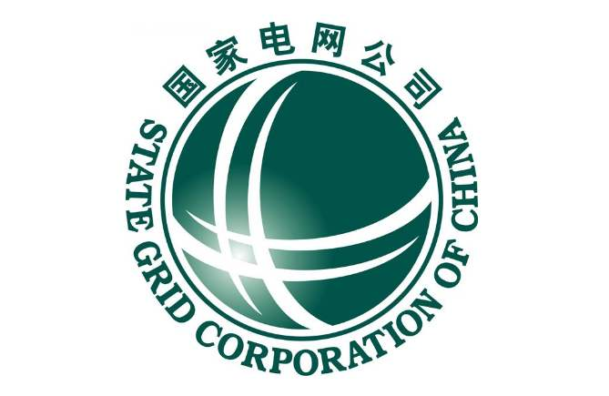

# Chenyu Yan

MS, Xi'an Jiaotong University, PRC

 <leo-chenyu.yan@stu.xjtu.edu.cn> 

## Education Background

I received BS degree with Electrical Engineering and Automation (GPA: 3.7/4.0) from [Northwestern Polytechnical University(NPU)](http://zdhxy.nwpu.edu.cn/English/English/Home.htm) in People Republic of China(PRC) in June 2016 and received MS degree with Electrical Engineering (GPA: 3.68/4.0) from [Xi'an Jiaotong University(XJTU)](http://ee.xjtu.edu.cn/English_Version1/home.htm) in PRC in June 2019. 

During postgraduate's study,  I was in Prof. [Shengtao Li](http://gr.xjtu.edu.cn/web/sli/23;jsessionid=3EE36B730115F7EC2AB0CDF2C0723015)'s group and my  research focused on charge transport modeling and calculation. Different from intensive researches on enhancing breakdown performance of power equipment, I attach more emphasis on **numerical calculation** of breakdown process, largely depending on mathematical modeling and programming, and demonstrate the hidden mechanism, which also shows a new perspective towards conventional research of dielectrics breakdown and obtained positive comments of other researchers. Under my prof. [Daomin Min](http://gr.xjtu.edu.cn/web/sli/22)'s guidance, I gradually formulated ability to deal with academic research and got a deeper insight towards my research area. During this period, I was involved in 3 projects and had 15 papers published.

## Publications 

 [My Research Gate](https://www.researchgate.net/profile/Chenyu_Yan4) 

1. Min DM, <u>**Yan CY**</u>, Huang Y, et.al. Dielectric and carrier transport properties of silicone rubber degraded by gamma irradiation[J]. Polymers, 2016, 9(10): 1-15 (SCI: 000414913800071; EI: 20174304306504)
2. Min DM, <u>**Yan CY**</u>, Mi R, et.al. Carrier Transport and Molecular Displacement Modulated dc Electrical Breakdown of Polypropylene Nanocomposites[J]. Polymers, 2018, 10(11): 1-20 (SCI: 000454456800029; EI: 20184606058526) 
3. Min DM, Li YW, <u>**Yan CY**</u>, et.al. Thickness Dependent dc Electrical Breakdown of Polyimide Modulated by Charge Transport and Molecular Displacement[J], 2018, Polymers, 10(9): 1-18 (SCI: 000449988800081; EI: 20183805840118)
4. Min DM, <u>**Yan CY**</u>, Wang WW, et al. Electrical breakdown of polymer nanocomposites modulated by space charges[C]. IEEE 17th International Conference on Nanotechnology, 2017: 267-269 (EI: 20180604700270)
5. Xie DR, <u>**Yan CY**</u>, Huang Y, et al. Study on short-term dc breakdown and corona resistance mechanism of polyimide. Proceedings of 2017 International Symposium on Electrical Insulating Materials, 2017: 437-441 (EI: 20180704798615) 
6. Kang WB, **<u>Yan CY</u>**, Li ST, et al. Trap and carrier transport of pristine and aged silicone rubber by surface potential measurements[C]. Proceedings of 2017 International Symposium on Electrical Insulating Materials, 2017: 207-210 (EI: 20180704798674)
7. Li SJ, Yan W, <u>**Yan CY**</u>, et al. Surface trap and carrier transport of aged and pristine oil-paper under harmonic voltage by surface potential decay[C]. IEEE Conference on Electrical Insulation and Dielectric Phenomenon, 2017:94-97 (EI: 20181505007629) 
8. Cheng L, Chi XH, <u>**Yan CY**</u>, et al. Polypropylene nanocomposite for power equipment: a review[J]. IET Nanodielectrics, 2018, 1(2): 92-103 
9. Min DM, <u>**Yan CY**</u>, Huang Y, et.al. Influence of filler content on conductivity of epoxy resin nanocomposites[C]. The 20th International Symposium on High Voltage Engineering, 2017: 1-6
10. Min DM, <u>**Yan CY**</u>, Mi R, et al. Space-charge modulated electrical breakdown in polyethylene nanodielelctrics[J]. IEEE Nanotechnology Magazine, 12(2): 15-22.
11. Mi R, <u>**Yan CY**</u>, Wu QZ, Min DM, Li ST. Effect of deep traps and molecular motion on dc breakdown of polyethylene nanocomposites[C]. IEEE Conference on Electrical Insulation and Dielectric Phenomenon 2019 
12. Li YW, <u>**Yan CY**</u>, Min DM, Li ST. Numerical simulation on dc breakdown of polyimide based on charge transport and molecular chain displacement[C]. IEEE Conference on Electrical Insulation and Dielectric Phenomenon 2019
13. Kang WB, Meng SX, Cui HZ, Li YW, Mi R, <u>**Yan CY**</u>, Min DM, Li ST. Space charge accumulation in silicone rubber influenced by Poole-Frenkel effect[C]. International Conference on novel functional materials, 2018: 1-5 (EI: 20185306321507)
14. Cui HZ, Xing ZL, Wu QZ, <u>**Yan CY**</u>, Mi R, Min DM, and Li ST. Accumulation of space charges in epoxy resin nanodielectrics influenced by Poole-Frenkel effect, International Conference on novel functional materials 2019 
15. Kang WB, Meng SX, Cui HZ, <u>**Yan CY**</u>, Min DM, Li ST. Trap and dielectric property evolution of silicone rubber insulation under power frequency voltage superimposed harmonic [J]. High voltage (Chinese)  

## Scholarship and Awards 

### Scholarship ### 

1. National Scholarship	2018.11 & 2017.11
2. First class scholarship    2018.11 & 2017.11
3. Scholarship for excellent freshman    2016.09
4. Provincial special scholarship    2015.09
5. First class scholarship    2015.09 & 2014.09 & 2013.09
6. E+H special scholarship    2014.09

### Awards ###

1. Outstanding graduated student    2019.06
2. Excellent postgraduate student award    2018.11 & 2017.11
3. National Mathematical Contest in Modeling for Graduated students, Honorable mention    2017.11
4. Outstanding graduated student award   2016.06
5. The 5th session of International MathorCup Mathematical Contest in Modeling, Outstanding award    2015.06
6. International Mathematical Contest in Modeling (MCM), Honorable mention    2015.03
7. National Mathematical Contest in Modeling, Outstanding award    2014.11
8. Best debater in debate competition in China   2014.10
9. Excellent world teenager in Japan, Korea and China forum    2014.09
10. Excellent student award    2015.11 & 2014.11 & 2013.11
11. National innovation training program, first class award, 2014.04 & 2015.04 & 2016.04

## Personal Statement ## 

During the learning and research in past few years, I had a deeper insight into the academic research and the desire to explore the unknown. In most time of my research period, I keep tackling with data and programming. Compared with other competitors, I believe I do have a good ability of learning and basis of computer science. Therefor, I am confident in completing this Ph.D program. Here I will introduce my previous experience regarding data science and computer science.

1. **Good coding basis and experience**

   Mathematical model competition and previous numerical calculation research help to form a good sense of **mathematical thinking, modeling, programming basis and paper writing**. Lots of models and algorithms, like  genetic algorithm, particle swarm optimization, neural network algorithm, etc.. To some extent, they help to form my very initial understanding of numerical calculation and modeling skill. I have ever participated Mathematical Contest in Modeling and obtained international/national award for 7 times.

   Since the BS stage, I started to get familiar with coding via **C++**, which is also obligatory course. In the third year of my BS phase, I undertook a **College Students' Innovative Entrepreneurial Training Plan Program** regarding the system for evaluation of faculty on campus. In that project, I developed the evaluation system based on C++. Compared with original system, new one can accurately determine the authenticity of takers' answers and got a comprehensive evaluation of teachers. In this project, my coding ability has much progress for it is the first time that I have acquaintance with practical project. Afterwards, I came to realize that coding is a tiny piece of entire computer science and it is quite necessary to have a well-rounded understanding regarding the computer science. Then I came to learn **Data Structures and Algorithm Analysis and Computer System a Programmer's perspective**, which taught me how computer processes my code and how to better and efficiently start a conversation between us. 

   When being involved in the study in master's period, a project required to collect vast data and give a prediction to the lifespan of electrical bush and oil paper, which means I have to be capable of  web crawler and machine learning. I came to learn Python and machine learning and I quickly, with no surprise, got familiar with **Python** programming due to familiarization of C++. Then I started to efficiently collect data via the web crawler and build forecasting model to quantitatively predict the lifespan of dielectric material, which turns to be in a good agreement with actual value. At present, I was learning **Machine Learning** (provided by Stanford University) and **Data science** (provided by IBM) to have a better understanding of technical trends and utilization on Coursera to get a systematic study of computer science. 

1. **Connections between my previous work and data science**

   As mentioned above, my research lies in a new insight towards traditional science. Most researchers are seeking for new methods or compounds to effectively promote electrical property of dielectrics, I, however, was concentrated on the internal behavior of mobile charges, which can in turn be used for explaining the mechanism of phenomena discovered by other researchers and inspire new ideas to modulate electrical property of dielectrics. Such a work largely relies on **data processing** (continuous simulation and experimental results generate vast data) and **programming**,  which guarantees my good ability to solve problems in an effective way. Apparently, my previous work has connection with computer science but for most time, my programing experience served for solving questions in my research, which means I never had a structural knowledge accumulation of CS, however, I do have a relatively good basis and desire to continue learning what I need for my research in following work. **I always believe that  the most important thing is not the knowledge itself, but the ability to acquire new knowledge, which is also the inherent nature of study**.

   After graduating from XJTU, I continued research work in State Grid Corporation of China (SGCC), however, compared with my research ares in MS phase, my work is inclined to the practical application rather than scientific research, especially my most work focused on data collection and processing based on electrical engineering, which is vital for profit of SGCC.
   
   

## Work Experience and Internship ## 

**State Grid Corporation of China     Department of Information and Internet   **  **2019.09 - Now** 

I worked in State Grid Corporation of China (SGCC), known as the largest power corporation in China, for half a year. In this period, I worked as a member in Department of Information and Internet, which focuses on data collection and processing to propose practical suggestions for the development of corporation. I have been involved in a project of **predicting short-term load of grid power**, including day load forecast and workload forecast. This work aimed at suppressing illegal electric larceny especially in corporation with relatively higher demand for electric resources, so that the lost profits can be reclaimed and SGCC also has a greater power to better distribute the power transmission. In this project, I was responsible for forecast modeling and data processing, which provided the basis of prediction. Specifically, with previous data of electric usage as the input, model was based on **RNN and LSTM model to forecast the electric demand for following 7 days**. By comparing with realistic values, it was proved that model had a relatively high precision and value of MAPE was around 2.1%. This can be a relative basis for following study regarding the machine learning and artificial intelligence, which is promising to foster interdisciplinary study.

**Asea Brown Boveri Ltd., China         Electrical Engineer Internship**     **2016.05-2016.09** 

 
 

I used to be an internship of technology department in ABB for four months. During this period, I have the initial understanding of industrialization of power system, especially the power capacitor. With an increase in familiarity with equipment, I have a more lucid concept for structure of power system and commercial market in this field. Plus, with the support of investigation in the equipment workshop, I learned the processing flow of capacitor, starting from the polypropylene film fabrication to the component assembly. In addition, I also got an opportunity to be engaged in the 		technical discussion with foreign experts, which largely bring inspiration to my further exploration on the research. Through intensive discussion, I found that increasing demand for high voltage transmission had been an urgent need for the grids in China, property of electric breakdown, however, was a key factor that determined the performance of power capacity. Therefore, when choosing the major field in my master phase, I forwardly approached to my professor and expressed my plan on the research of breakdown property of polypropylene. Different from most researches, I attached more emphasis on the simulation and modeling calculation, which can reveal the interior mechanism and bring more novel ideas to this field. One more thing, it is worth being mentioned that **I developed a program based on C++ during my internship to help collecting documents to meet the needs of engineers, which was applied to be integrated to power production management system and used until now.**

##  Highlights of research

**Carrier Transport and Molecular Displacement Modulated (CTMD) model**

This model considers the charge injection, migration, trapping/detrapping and recombination dynamic process.

 Fig. Scheme of CTMD model and molecular chain displacement model 

Charges are continuously injected from electrodes to the bulk of samples and they may be captured by traps (both shallow traps and deep ones). When captured by deep traps, which means charges need to obtain higher energy to detrap, charge keep retention for a longer period. Also, during the migration from one electrode to another one, combination may occur when a positive charge encounters a negative one. Such a dynamic process includes entire charge motion  This model is used for calculating the charge transport property in the bulk of insulating material, including numerical calculation of space charge and electrical field distribution, energy gained by electrons as well as electrical strength. This model was once used for explaining the electrical breakdown behavior of polypropylene (PP, used for film of power capacitor) nanocomposite. By combining the experimental results and calculation of model, hidden electrical breakdown mechanism of PP nanocomposite was revealed. Details regarding the model can be seen in [Carrier Transport and Molecular Displacement Modulated dc Electrical Breakdown of Polypropylene Nanocomposites](#).

Based on this model, we investigate the electrical breakdown property of PI samples with various thicknesses. It is found that similar mechanism modulates the breakdown behavior of PI and simulations results are better fit than the space charge electrical breakdown (SCEB) model. Relating results and comparison can be found in [Thickness-Dependent DC Electrical Breakdown of Polyimide Modulated by Charge Transport and Molecular Displacement.](#)

**Dielectric property simulation of insulating material**

Method of modeling on dielectric property of aging Silicone Rubber is proposed. Specifically, by fitting the spectra to theoretical equations, we separated different polarization processes at various frequencies and calculated the values of corresponding parameters like thermal expansion coefficient, swelling ratio, etc.. By utilizing the correlations among various parameters, polarization property and specific process of SiR was delineated. Additionally, paper investigated the influence of degradation on the dielectric constant at high frequencies, ion concentration, conductivity and trap distribution, illustrating the charge transport property in the bulk of SiR and revealed the hidden cause for polarization. More information can be seen in [Dielectric and Carrier Transport Properties of Silicone Rubber Degraded by Gamma Irradiation](#)

For your information, more papers can be found in:

- [Electrical breakdown of polymer nanocomposites modulated by space charges](#)
- [Study on short-term dc breakdown and corona resistance mechanism of polyimide](#)
- [Trap and carrier transport of pristine and aged silicone rubber by surface potential measurements](#)
- [Surface trap and carrier transport of aged and pristine oil-paper under harmonic voltage by surface potential decay](#)
- [Polypropylene nanocomposite for power equipment: a review](#)
- [Space-charge modulated electrical breakdown in polyethylene nanodielelctrics](#)
- [Effect of deep traps and molecular motion on dc breakdown of polyethylene nanocomposites](#)
- [Numerical simulation on dc breakdown of polyimide based on charge transport and molecular chain displacement](#)
- [Space charge accumulation in silicone rubber influenced by Poole-Frenkel effect](#)
- [ Accumulation of space charges in epoxy resin nanodielectrics influenced by Poole-Frenkel effect](#)
- [Dielectric properties of aged and pristine oil-paper under harmonic voltage by frequency domain spectroscopy](#)

## Project Experience ##

- **Influence of molecular chain motion property in interfacial regions on dc breakdown property of polyethylene nanocomposites (National Natural Science Foundation of China, 2016-2019) ** 

  

  This project was originated from the need for enhancing breakdown property of polyethylene to meet up with its demand for high voltage power transmission. Based on the motion property of molecular chains at the interfacial regions, this study investigated its impact on dc breakdown property of polyethylene nanocomposites and revealed the mechanism of PE breakdown. I'm responsible for model compiling and paper writing (academic paper and project report).

- **Insulating property and its regularity of dielectrics in current transfer and energy dissipation (National Key Basic Research Program (973) sub-project, 2016-2019)** 

  
           

  This project investigated the coupling impact of space charge accumulation, transient arc micro particle bombardment, metal particle deposition on the falshover property of fractrue insulating system in the process of dc arc switching, and revealed its influence regularity and failure mechanism. Study figured out the the methods to suppress the space charge accumulation and metal particle deposition in the fracture insulating system and proposed approaches to resist flashover damage and aging. This research provided the theoretical and technology support for enhancing the voltage, current as well as lifespan of circuit breaker. I was mainly involved in the modeling of energy accumulation and flashover process, and investigated the influence of charge transport parameters and temperature on flashover behavior.

- **Charge transport property in silicone rubber under harmonic aging (Project of China Electric Power Research Institute, 2016-2018)**
  This project was originated from the need that power equipment like cable and bush are easier to be aged under the high-order harmonics, which hence deteriorated the performance of power system. The study, taking the silicon rubber from the outer coat of cable terminals and the insulating oil paper in the bush as the research objects, quantitatively manifested the aging status and summarized the insulating material deterioration regularity. In addition, aging model for cable and bush were proposed to predict their odd lifespans and the mechanism of aging has been demonstrated. I was responsible for experiment design, modeling calculation and paper writing.

- **Design for large scale vehicle battery management system based on ARM (National innovation training program, 2014-2015)**

  This project was originated from the need for a more efficient battery management for electrical vehicles. Research focused on energy consumption control of lithium battery during the operation process of electrical vehicles and optimized efficiency of battery via parameter self-regulation as well as safety control. This system completed the process from data collection to the hardware circuit design as well as discharge control, SOC estimation and closed-loop design of communication feedback. I was the leader of this project and got the national first class award.

- **Design of wireless sensor network node with high performance(National innovation training program, 2015-2016)**

  This project is originated from the need from need of intelligent farm. Communication among various nodes is crucial for the routine working (like watering and cropping duster). Research aims at the performance promotion of interaction and communication among various nodes, which redesign the structure of node itself and combination of various nodes to prolong the lifespan of node and achieve coordination of low consumption and high performance.

